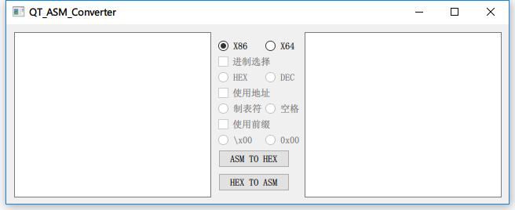
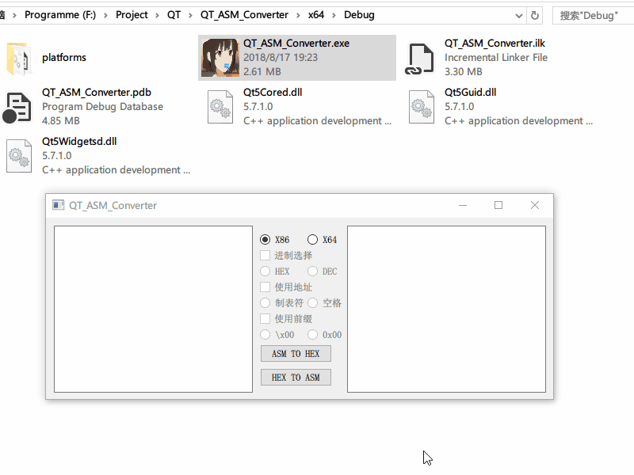

# QT_ASM_Converter

<h1 align="center">
	
	 
	 
</h1>

<h1 align="center">
	
	 
	 
</h1>

### Reference:

https://github.com/zyantific/zydis

https://github.com/x64dbg/XEDParse

静态编译可以直接使用的exe在release里面下载
